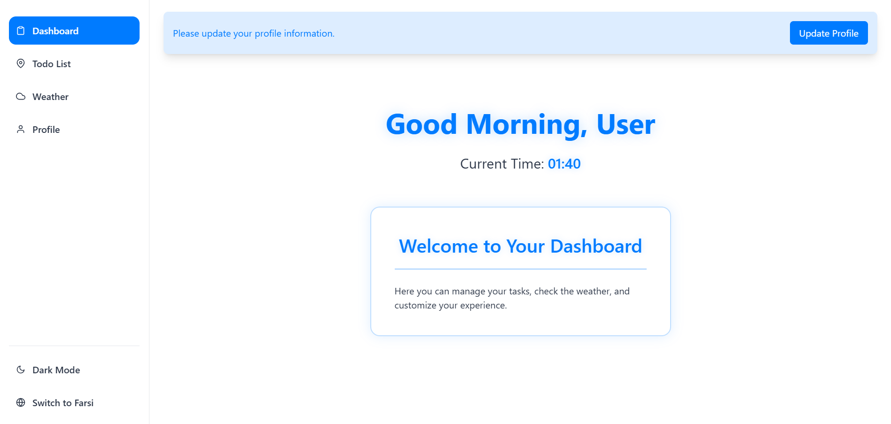
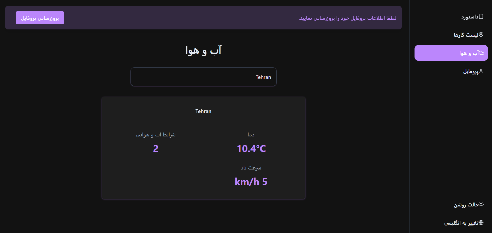

# Modern Dashboard App

A feature-rich, responsive dashboard application built with React, Redux, and TypeScript that provides an intuitive user interface with powerful functionality.

## ✨ Key Features

### 🌓 Theme Switching

- Seamless switching between light and dark themes
- Carefully crafted color schemes for optimal visibility
- Smooth theme transitions with animations

### 🌐 Internationalization

- Multi-language support with RTL (Right-to-Left) capabilities
- Automatic text direction switching based on language
- Currently supports English and Farsi, easily extensible

### 📱 Responsive Design

- Fully responsive layout that works on all devices
- Adaptive sidebar that collapses on mobile
- Optimized touch interactions for mobile users

### 🎯 Core Features

- **Dashboard Overview**: Quick access to key metrics and information
- **Todo Management**: Create, edit, and track tasks with animations
- **Weather Widget**: Real-time weather information
- **User Profile**: Customizable user settings and preferences

### 🎨 UI/UX Features

- Smooth page transitions and animations
- Intuitive navigation with active state indicators
- Context-aware notifications
- Consistent styling with styled-components

## 🛠️ Technical Stack

- **React** with TypeScript
- **Redux** for state management
- **Styled Components** for styling
- **Framer Motion** for animations
- **i18next** for internationalization
- **Local Storage** for data persistence

## 🚀 Getting Started

1. Clone the repository
